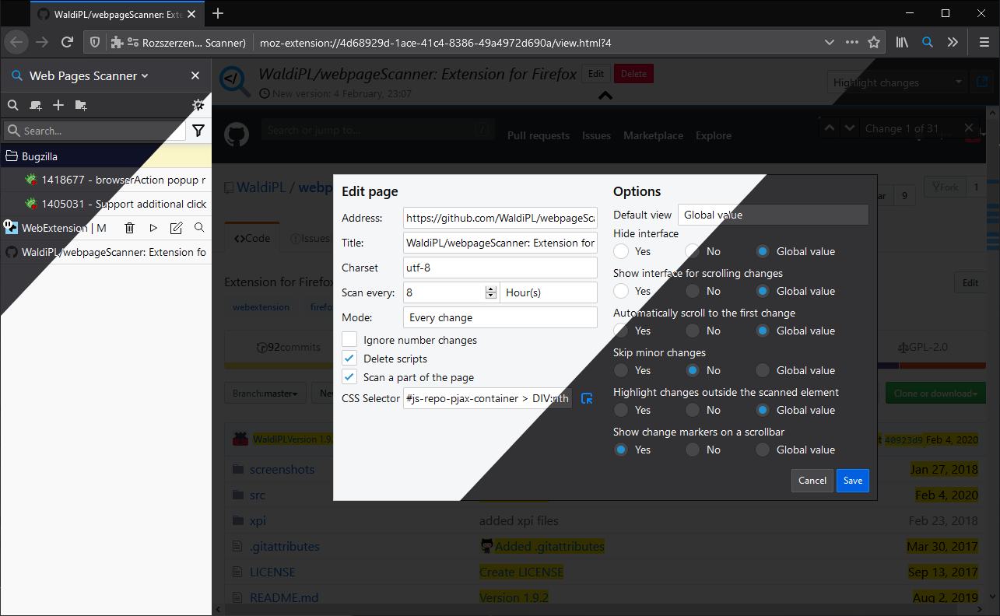

# Web pages scanner 
Scan web pages for updates.

Features:
- unlimited number of pages
- automatic and manual asynchronous scanning
- ability to change charset, accuracy, interval between scans
- notifications about detected changes
- easily add pages to scan list
- preview old and new version of page
- sidebar
and a lot more...

## Screenshot

## Requirements
- Firefox 60+

## Permissions
- Tabs
- Storage
- Alarms
- Notifications
- Context menus
- <all_urls>
- Bookmarks (optional)

## Download
https://addons.mozilla.org/firefox/addon/web-pages-scanner?src=external-github
